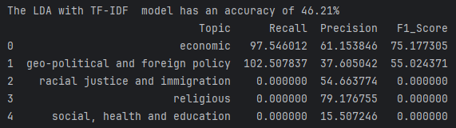

# Topic Modeling

## Zbiór danych
Wykorzystałem zbiór danych [JyotiNayak/political_ideologies](https://huggingface.co/datasets/JyotiNayak/political_ideologies?row=5),
który zawiera 2560 tekstów wygenerowanych przez GPT-4. Orginalnie podzielone są na 8 kategorii:
* economic
* environmental
* family/gender
* geo-political and foreign policy
* political
* racial justice and immigration
* religious
* social, health and education

### Wstępne przetwarzanie
* Usunięcie znaków specjalnych
* Usunięcie stop words
* Lemmatyzacja

### Analiza zbioru

#### Liczebność klas
Każda z etykiet ma zbliżoną liczebność, co jest korzystne dla modelu. 

#### Dystrybucja długości tekstu
Dla całego zbioru

Rozkład długości tekstu sprawdzono również dla każdej z klas z osobna.
Można zauważyć, że rozkład długości tekstu w każdej klasie jest zbliżony.

#### Najczęstsze słowa
Sprawdzono najczęstsze słowa w zbiorze już po oczyszczeniu i lematyzacji.

Dodatkowo sprawdzono częstotliwość występowania top 5 słów w poszczególnych klasach.

## Model
W projekcie wykorzystano model LDA (Latent Dirichlet Allocation) z trzema reprerzentacjami tekstu:
* CountVectorizer
* TF-IDF
* BM25

Dla każdej z reprezentacji przeprowadzono proces optymalizacji liczby tematów, których ilość wynosiła od 5 do 13.

## Wyniki
Dla każdego modelu sprawdzono metryki testowe:
* precision
* recall
* f1-score

Jednak nie jest to najlepsza metryka dla modeli LDA, ponieważ nie ma możliwości przypisania jednoznacznie dokumentu do jednej klasy.

Dlatego też postanowiono zwizualizować wyniki za pomocą:
* WordCloud
* pyLDAvis

### CountVectorizer
Model z reprezentacją CountVectorizer osiągnął najlepsze wyniki dla 7 tematów.

Jego klasy są mapowane na kategorie z oryginalnego zbioru danych na podstawie największej liczby przypisanych do danej klasy dokumentów.

Metryki testowe dla modelu z reprezentacją CountVectorizer:

Wykres przedstawia ilość etykiet w orginalnym zbiorze (niebieski) i porównanie tej wartości z ilością
przypisanych dokumentów do odpowiadającyh klas (pomarańczowy), bazując na zmapowanych danych.

Wordcloud dla każdego z tematów:

pyLDAvis:

Z pliku: static/pyLDAvis/lda_visualisation.html

### TF-IDF
Model z reprezentacją TF-IDF osiągnął najlepsze wyniki dla 5 tematów.

Jego klasy są mapowane na kategorie z oryginalnego zbioru danych na podstawie największej liczby przypisanych do danej klasy dokumentów.

Metryki testowe dla modelu z reprezentacją TF-IDF:

Wykres przedstawia ilość etykiet w orginalnym zbiorze (niebieski) i porównanie tej wartości z ilością
przypisanych dokumentów do odpowiadającyh klas (pomarańczowy), bazując na zmapowanych danych.

Wordcloud dla każdego z tematów:

pyLDAvis:

Z pliku: static/pyLDAvis/lda_visualisation_tfidf.html

### BM25
Model z reprezentacją BM25 osiągnął najlepsze wyniki dla 5 tematów.

Jego klasy są mapowane na kategorie z oryginalnego zbioru danych na podstawie największej liczby przypisanych do danej klasy dokumentów.

Metryki testowe dla modelu z reprezentacją BM25:

Wykres przedstawia ilość etykiet w orginalnym zbiorze (niebieski) i porównanie tej wartości z ilością
przypisanych dokumentów do odpowiadającyh klas (pomarańczowy), bazując na zmapowanych danych.

Wordcloud dla każdego z tematów:

pyLDAvis:

Z pliku: static/pyLDAvis/lda_visualisation_bm25.html

## Narzędzia i środowisko

### Użyte narzędzia
* Python 3.12
* spaCy
* nltk
* pyldavis
* wordcloud
* joblib
* rank-bm25
* pyTorch
* scikit-learn
* pandas
* numpy
* seaborn
* matplotlib
* datasets

### Środowisko sprzętowe
* CPU: Intel(R) Core(TM) i5-9300H CPU @ 2.40GHz
* GPU: NVIDIA GeForce RTX 2060
* RAM: 32GB